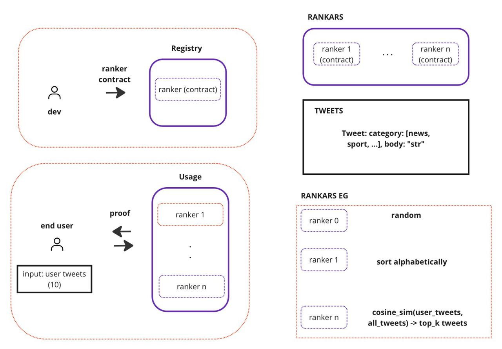

zk-timeline is a project to democratize ranker usage inside various timelines (e.g., social media).

General architecture:

To run the project:

before running the project make sure you added your Hugging Face API KEY as HF_API_KEY in .env.example in the root directory.

```bash
    npm i
    npm run dev
```