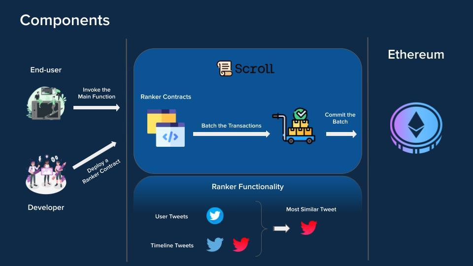

# ZK-Timeline
zk-timeline is a project to democratize ranker usage inside various timelines (e.g., social media). Check out our live demo [here](https://zktimeline-ui.vercel.app/).

## Description

This project introduces a revolutionary approach to social media feed generation, focusing on personalization, transparency, and integrity through the use of zero-knowledge verification technology. At its core, the platform aims to create a social media experience where users have complete confidence that their feed is tailored specifically to their interests, free from external biases or hidden agendas.

The system leverages the [Scroll](https://scroll.io/) network's zk-rollup capability for its efficiency in processing transactions. This technology is particularly important for handling the complex operations involved in ranking and delivering personalized content to users.


### Key components:



1. **User Interaction:** Users express their preferences and interact with the system's ranking mechanism through the Scroll interface, directly influencing how content is personalized for them.

2. **Ranker Contracts:** Developers create smart contracts, referred to as rankers, that analyze and prioritize content based on user preferences. These contracts can filter content across various dimensions, such as topics or themes, ensuring users receive content that genuinely interests them.

3. **Batching and Committing:** The [Scroll](https://scroll.io/)  system aggregates user transactions and commits them as a batch to the Ethereum blockchain in a single transaction. This process utilizes zero-knowledge proofs to guarantee the integrity of the selections, confirming they are unaltered and precisely reflect the ranker's decisions.

4. **Verification:** The system provides a transparent and verifiable process, allowing users to see and trust the mechanism that ranks and selects the content in their feed. This is achieved through the use of zero-knowledge proofs, ensuring the entire process, from selection to display, is trustworthy and secure.


## How It's Made


The project is built on a the Scroll network's zk-rollup capability. Here's a breakdown of how these components are pieced together:

- **Ethereum Blockchain:** Serves as the underlying infrastructure for transaction recording and smart contract execution, providing a secure and immutable ledger for ranker contracts and user interactions.

- **Scroll's zk-rollup:** Utilized for its efficient transaction processing capabilities on the Ethereum blockchain. This technology plays a crucial role in managing the system's operations, from user interactions with rankers to the batching and committing of selections.

- **Smart Contracts (Ranker Contracts):** Developed to analyze and prioritize content based on defined criteria. These contracts are a crucial part of the system's architecture, enabling the automated and unbiased ranking of content.

- **Text Embeddings and AI:** For more advanced personalization, the system uses language model-based encoders to generate text embeddings. This allows for the comparison of textual content at a more nuanced level, enabling the system to identify and rank content that is most relevant to the user's interests, based on the tweets' body itself.


This project emphasizes personalization, ensuring that content delivery is tailored to individual preferences, while maintaining transparency and integrity through zero-knowledge proofs. By leveraging Scroll's capabilities, it offers a groundbreaking approach to secure, bias-free content curation and distribution, setting a new standard for trust and relevance in digital feeds.

## Getting Started

before running the project make sure you added your [Hugging Face](https://huggingface.co/) API KEY as HF_API_KEY in .env.example in the root directory + other env variables based example provided.

```bash
    npm i
    npm run dev
```